# Freecodecamp JavaScript

### Enlace al video: [Build 15 JavaScript Proyects - Vanilla JavaScript Course](https://www.youtube.com/watch?v=3PHXvlpOkf4&t=25756s "Watch the video!")

#### Curso en el que se desarrollan 15 proyectos utilizando JavaScript.

#### El curso pertenece al desarrollador web John Smilga, creador de Coding Addict. A continuación dejo un enlace a [su página web](https://www.johnsmilga.com/) y a [su canal de YouTube](https://www.youtube.com/codingaddict).

#### El código JavaScript es prácticamente idéntico, aunque he modificado parte de los estilos de la mayoría de los proyectos.

 

### Lista de proyectos:

#### 1. Color flipper

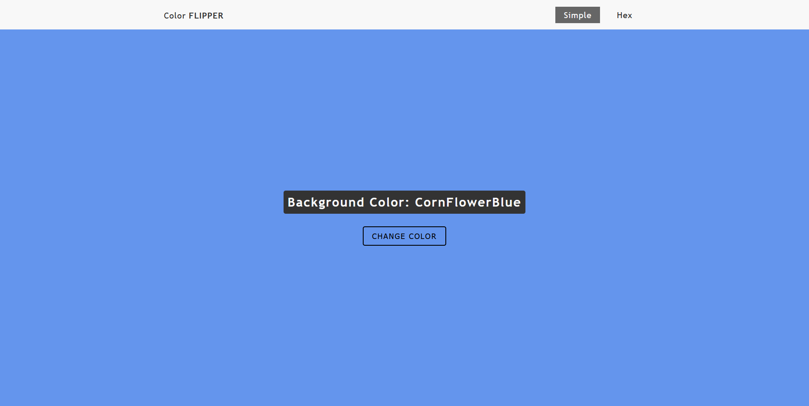

 

#### 2. Counter

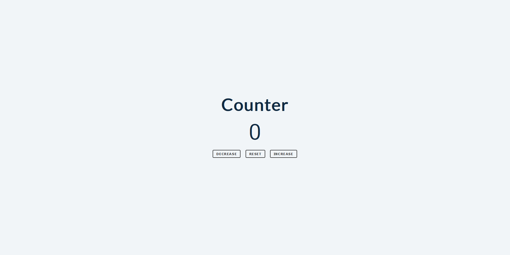

 

#### 3. Reviews

 

#### 4. Navbar

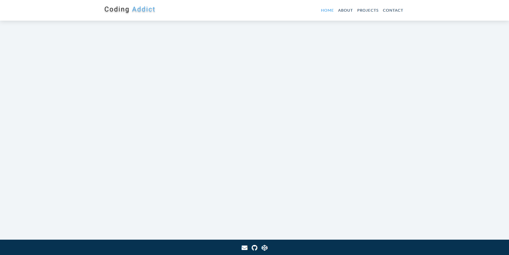

 

#### 5. Sidebar

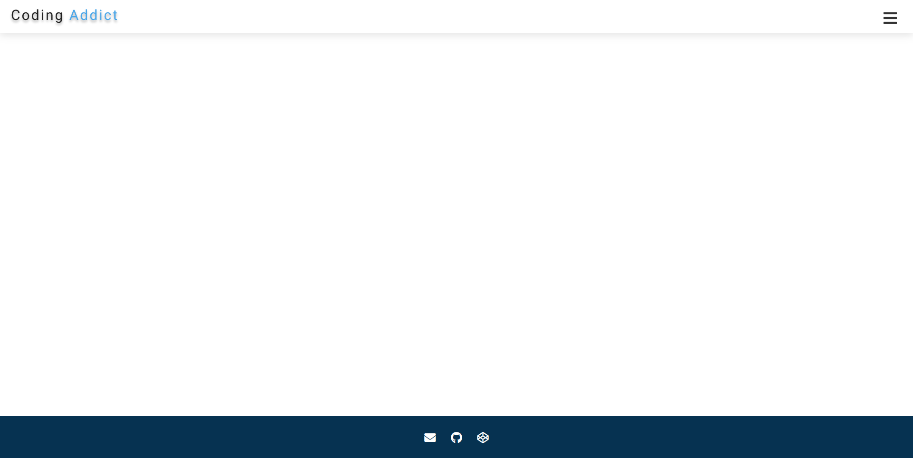

 

#### 6. Modal

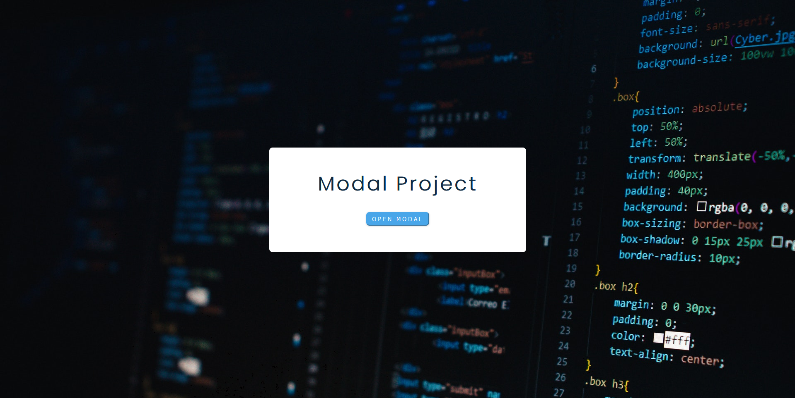

 

#### 7. Questions

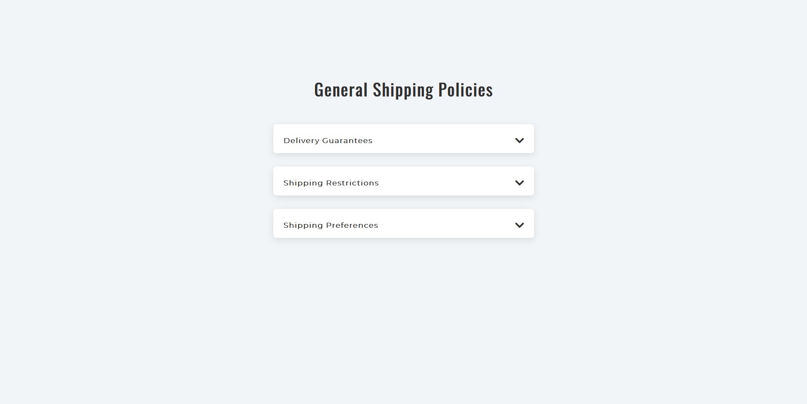

 

#### 8. Menu

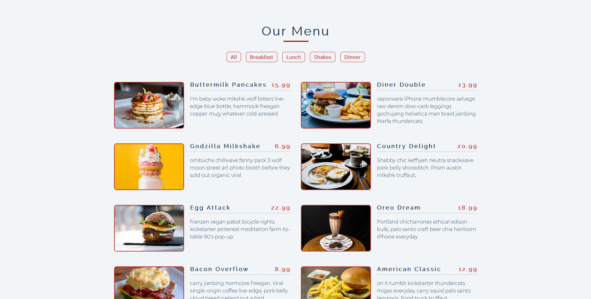

 

#### 9. Video

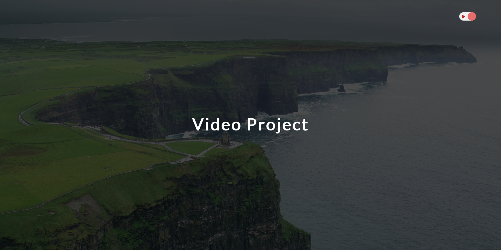

 

#### 10. Scroll

 

#### 11. Tabs

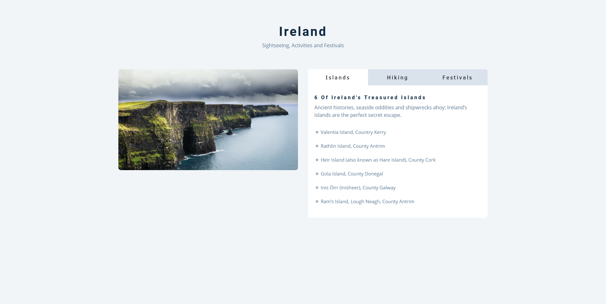

 

#### 12. Countdown timer

 

#### 13. Lorem ipsum

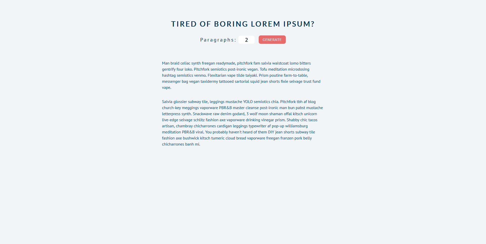

 

#### 14. Grocery bud

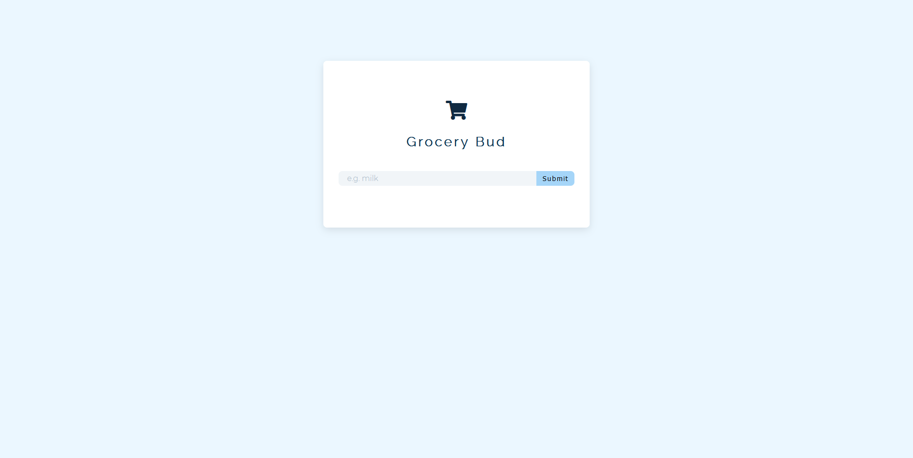

 

#### 15. Slider

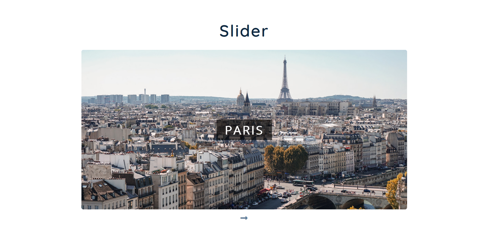
