# Freecodecamp JavaScript

### Enlace al video: [Build 15 JavaScript Proyects - Vanilla JavaScript Course](https://www.youtube.com/watch?v=3PHXvlpOkf4&t=25756s "Watch the video!")

### Curso en el que se desarrollan 15 proyectos utilizando JavaScript puro, es decir, sin ninguna librería o framework.

### Lista de proyectos:

 

### 1. Color flipper

 

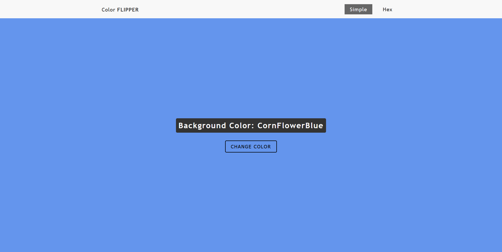

 

### 2. Counter

 

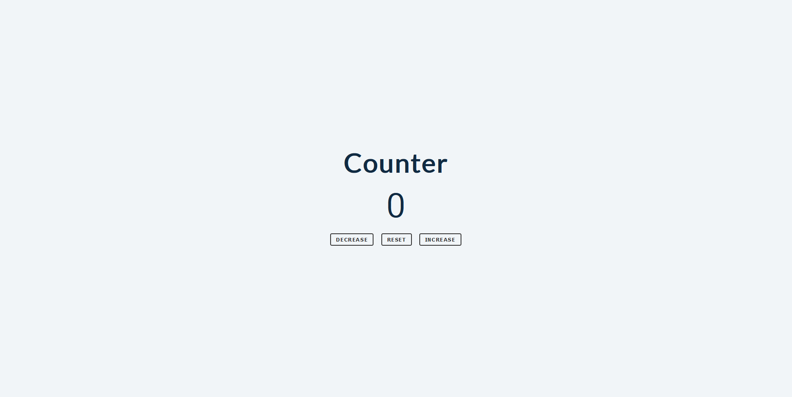

 

### 3. Reviews

 

 

### 4. Navbar

 

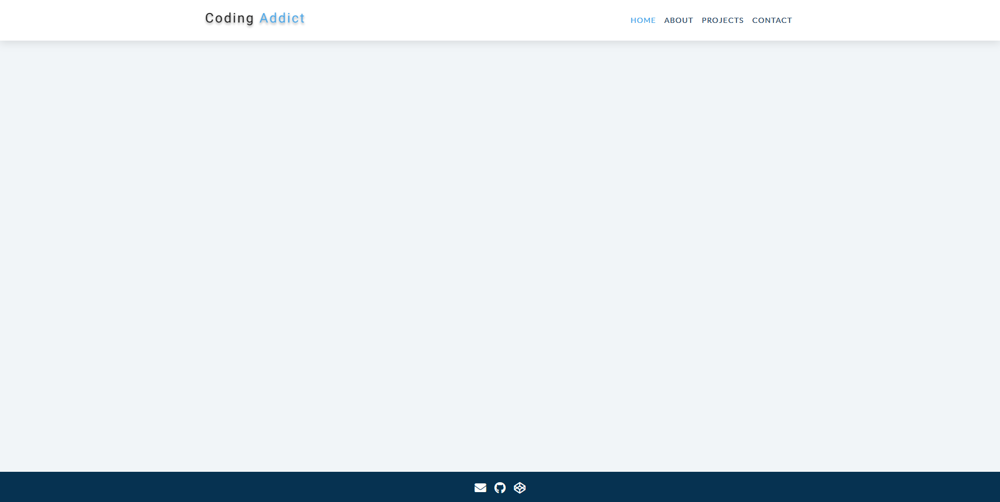

 

### 5. Sidebar

 

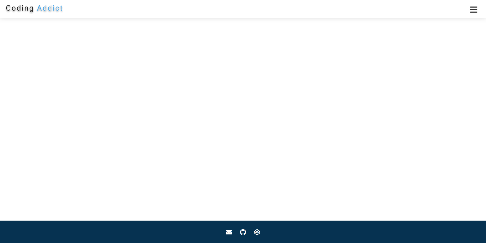

 

### 6. Modal

 

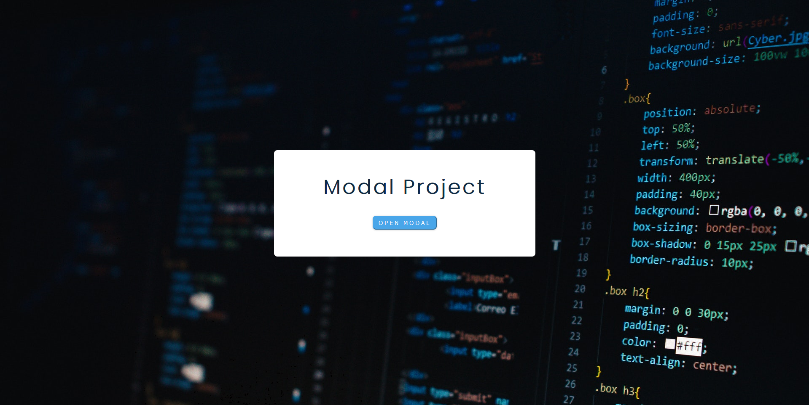

 

### 7. Questions

 

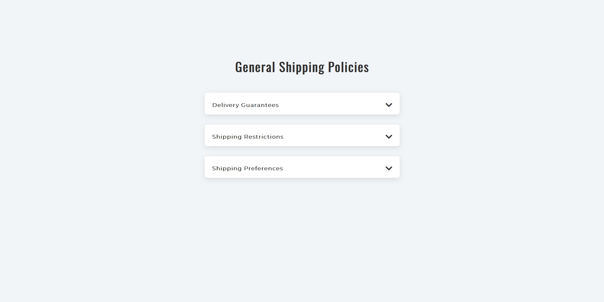

 

### 8. Menu

 

 

### 9. Video

 

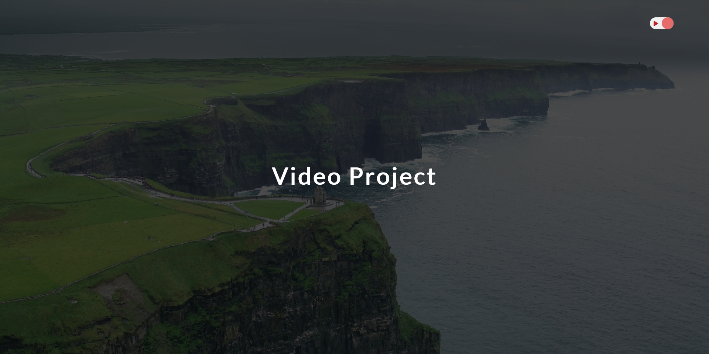

 

### 10. Scroll

 

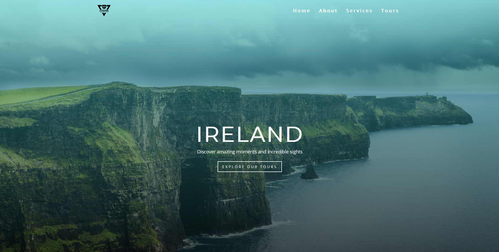

 

### 11. Tabs

 

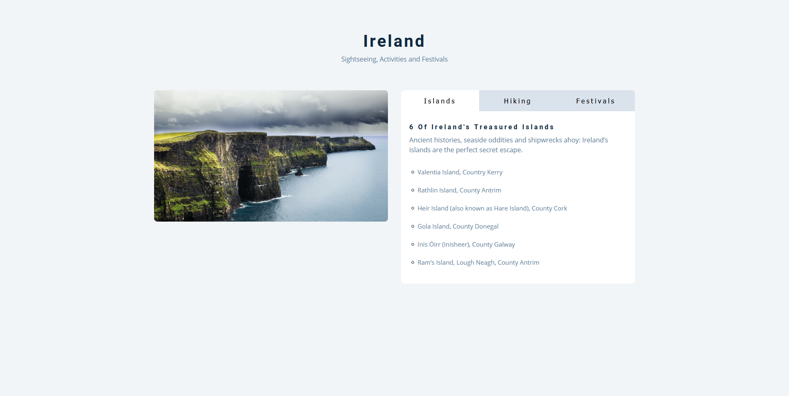

 

### 12. Countdown timer

 

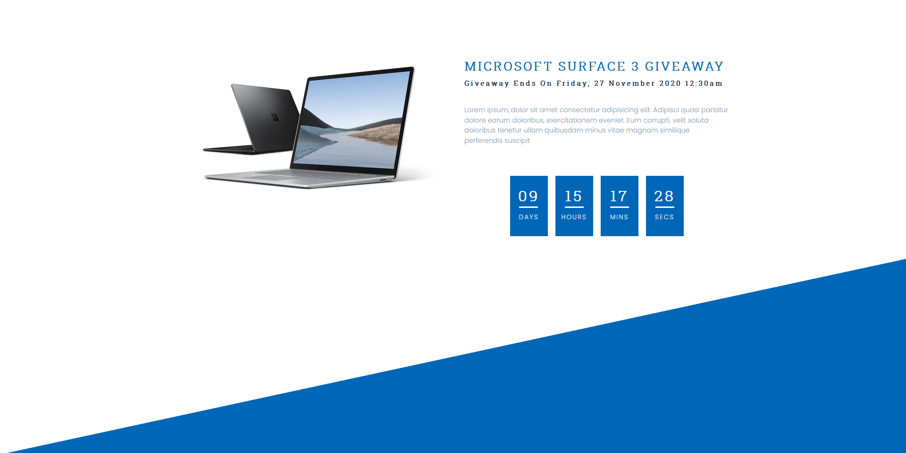

 

### 13. Lorem ipsum

 

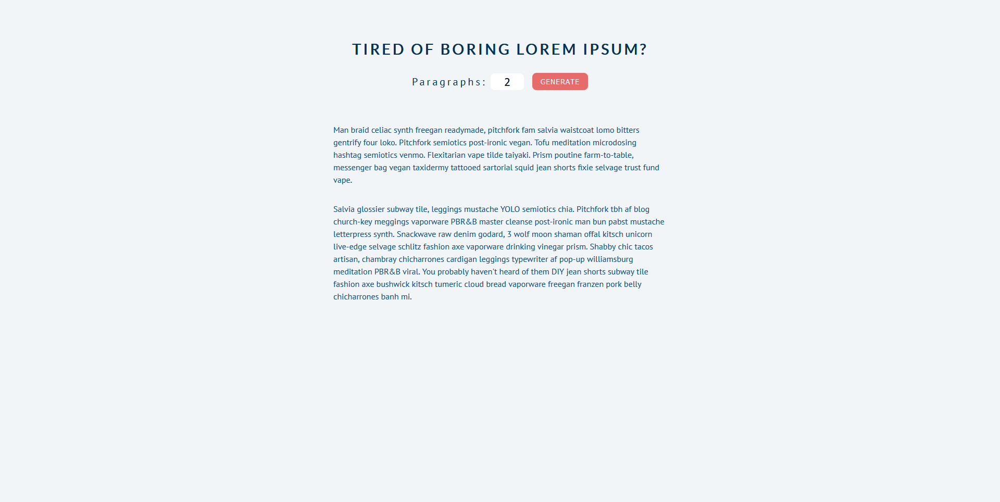

 

### 14. Grocery bud

 

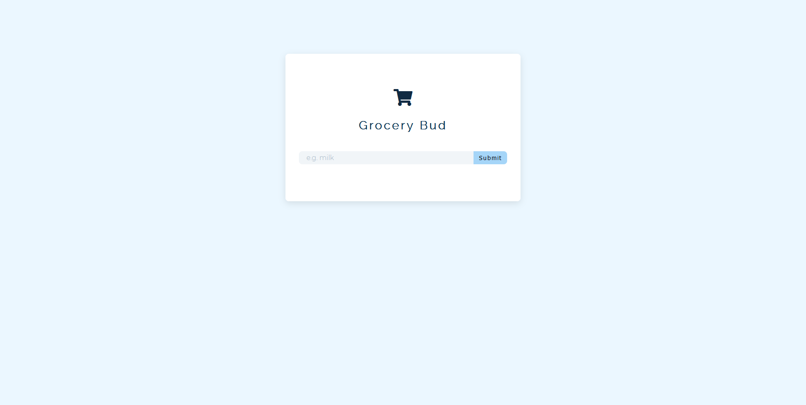

 

### 15. Slider

 

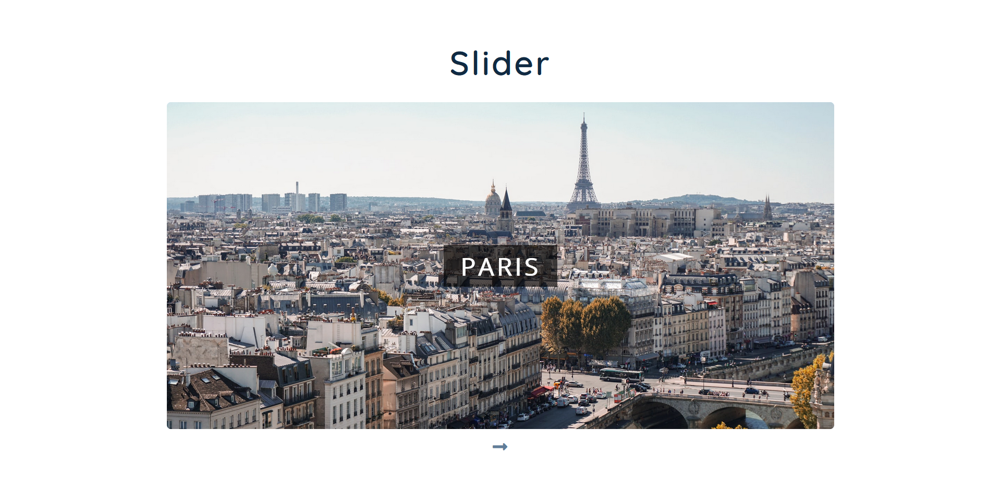
